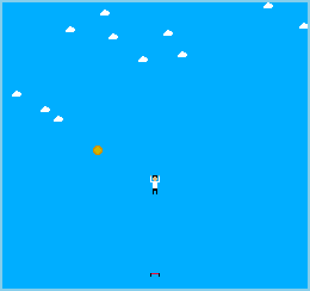

Jump

Author: Pengtao Ni

Design: The player controls a character who's jumping on a trampoline. Each time the character gets a coin, it jumps higher.

Screen Shot:

How Your Asset Pipeline Works:

PNG files (8*8 pixels edited with Photoshop) in assets folder are imported and processed into tiles and palettes at run time.

How To Play:

Left / right arrow controls the character's movement.
"R" restarts the game.

Sources: None

This game was built with [NEST](NEST.md).

